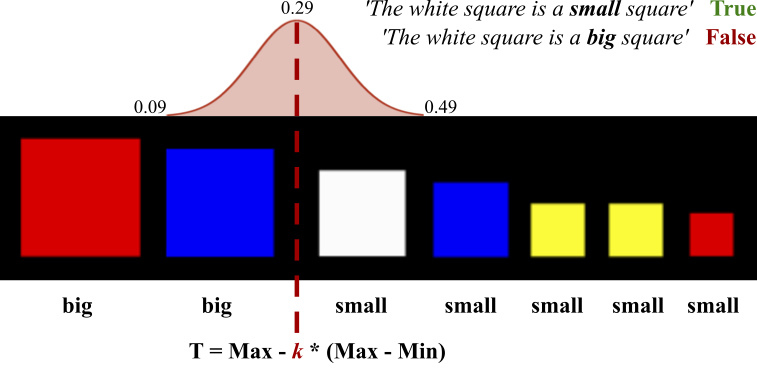

# MALeViC
**MALeViC**: **M**odeling **A**djectives **Le**veraging **Vi**sual **C**ontexts

Code and data presented in:

1) Pezzelle & Fernández (2019). [Is the *Red Square* Big? MALeViC: Modeling Adjectives Leveraging Visual Contexts](https://arxiv.org/pdf/1908.10285.pdf). To appear in the Proceedings of EMNLP-IJCNLP 2019

**Abstract**
This work aims at modeling how the meaning of gradable adjectives of size ('big', 'small') can be learned from visually-grounded contexts. Inspired by cognitive and linguistic evidence showing that the use of these expressions relies on setting a threshold that is dependent on a specific context, we investigate the ability of multi-modal models in assessing whether an object is 'big' or 'small' in a given visual scene. In contrast with the standard computational approach that simplistically treats gradable adjectives as *fixed* attributes, we pose the problem as relational: to be successful, a model has to consider the full visual context. By means of four main tasks, we show that state-of-the-art models (but not a relatively strong baseline) can learn the function subtending the meaning of size adjectives, though their performance is found to decrease while moving from simple to more complex tasks. Crucially, models fail in developing abstract representations of gradable adjectives that can be used compositionally.

2) Pezzelle & Fernández (2019). *Big* Generalizations with *Small* Data: Exploring the Role of Training Samples in Learning Adjectives of Size. To appear in the Proceedings of LANTERN 2019 co-located with EMNLP-IJCNLP 2019

**Abstract**
In this paper, we experiment with a recently proposed visual reasoning task dealing with quantities – modeling the multimodal, contextually-dependent meaning of size adjectives ('big', 'small') – and explore the impact of varying the training data on the learning behavior of a state-of-art system. In previous work, models have been shown to fail in generalizing to unseen adjective-noun combinations. Here, we investigate whether, and to what extent, seeing some of these cases during training helps a model understand the rule subtending the task, i.e., that being big implies being not small, and *vice versa*. We show that relatively few examples are enough to understand this relationship, and that developing a specific, mutually exclusive representation of size adjectives is beneficial to the task.

Best models and pretrained ResNet101 visual features for all the tasks can be downloaded from: [MALeViC](https://zenodo.org/record/3516924#.XbLnQJMzZQI)

For questions, info, feedback please contact:
s.pezzelle@uva.nl
